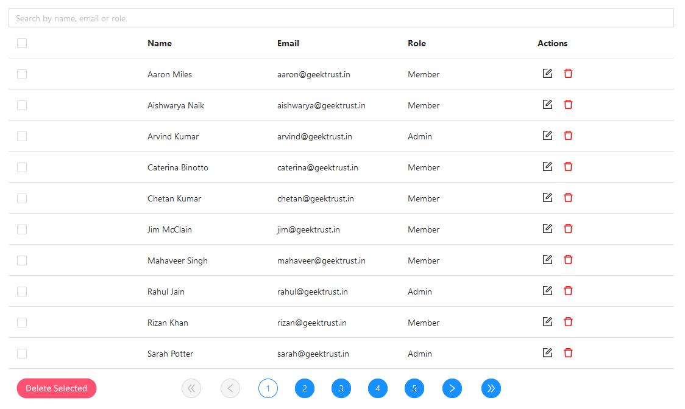

# Admin UI

### made as part of [geektrust weekend coding challenge](https://www.geektrust.in/coding-problem/frontend/adminui?utm_source=customer_list&utm_medium=email&utm_campaign=ocw2&utm_content=adminui)

 

## The challenge:

Build a UI for Admins to see and delete users. The users will be provided via an [API]('https://geektrust.s3-ap-southeast-1.amazonaws.com/adminui-problem/members.json').

These are the requirements:

- a search bar that can filter on any property.

- edit or delete rows in place.(There is no expectation of persistence. Edit and delete are expected to only happen in memory.)

- implement pagination with special buttons to jump to next, prev, first and last pages.

- Select one or more rows. Delete single and multiple rows using buttons.

- Checkbox to toggle select all rows on current page only

## Links

- [Github](https://github.com/winay05/admin-ui)
- [Live URL](https://admin-ui-vinay.netlify.app/)
   

## How I build it

- React.js - _UI_
- react-bootstrap, bootstrap and custom CSS - _styling_
- custom pagination as a wrapper for table rows
- custom debounce searching for search-bar

## Challenges faced

- Editing cells inline - solved by dynamically adding editable props to fields
- Pagination - made custom paging component
  - Dyanmically rendering the page buttons as per the data (state was not updating when props are changed in the parent and couldn't use componentDidUpdate because I had to change the state and doing so would create and infinite loop of update-render. Used the componentWillReceiveProps lifecycle method instead)
   
   
  

### How to run the project

This project was bootstrapped with [Create React App](https://github.com/facebook/create-react-app).

### Available Scripts

In the project directory, you can run:

### `npm start`

Runs the app in the development mode.\
Open [http://localhost:3000](http://localhost:3000) to view it in the browser.

The page will reload if you make edits.\
You will also see any lint errors in the console.

### `npm run build`

Builds the app for production to the `build` folder.\
It correctly bundles React in production mode and optimizes the build for the best performance.
